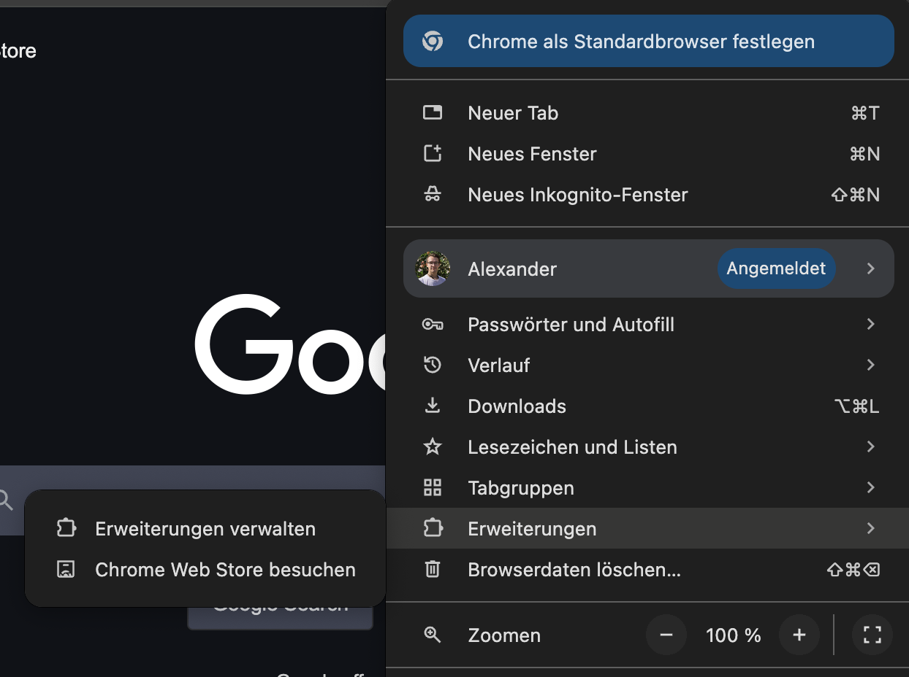
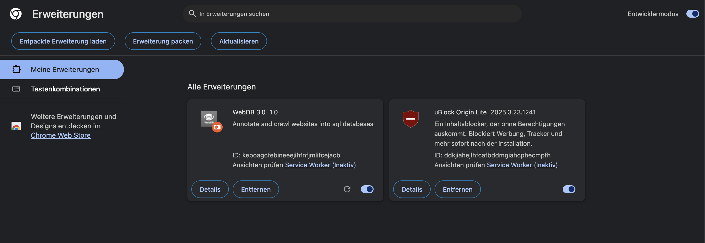

# Installation

Die WebDB Chrome Erweiterung lässt sich auf [webdb.click](https://webdb.click) herunterladen.
Alternativ auch [hier](https://files.webdb.click/webdb.zip) als direkter link.

Die heruntergeladene Datei ist ein Zip-Archiv, das bedeutet sie muss erst
entpackt werden, bevor sie verwendet werden kann. Ich denke dieser Schritt sollte
ohne weitere Erklärung machbar sein.

Daraufhin sollte es einen neuen Ordner geben, in dem sich der Code für
die Erweiterung befindet.

Um diese Erweiterung zu laden, muss die Erweiterungs-Seite in Chrome geöffnet
werden. Dazu:

- Oben rechtes, auf die drei Punkte klicken
- Erweiterungen
- Erweiterungen Verwalten

Dies öffnet die interne `chrome://extensions/` Seite. Dort oben rechts den Entwicklermodus
aktivieren, um die Erweiterung laden zu können. Danach nun auf den "Entpackte
Erweiterung laden"-Knopf oben link klicken und in dem neu geöffneten Fenster
nun den zuvor entpackten Ordner auswählen.

Das ganze sollte nun etwa so aussehen:

Für eine einfachere Nutzung, empfehle ich die Erweiterung zu "Pinnen". Dazu auf
das Puzzle Symbol oben rechts klicken und den Pin neben "WebDB 3.0" anklicken.
Daraufhin befindet sich das WebDB icon fest oben in der Navigations-Leiste.
