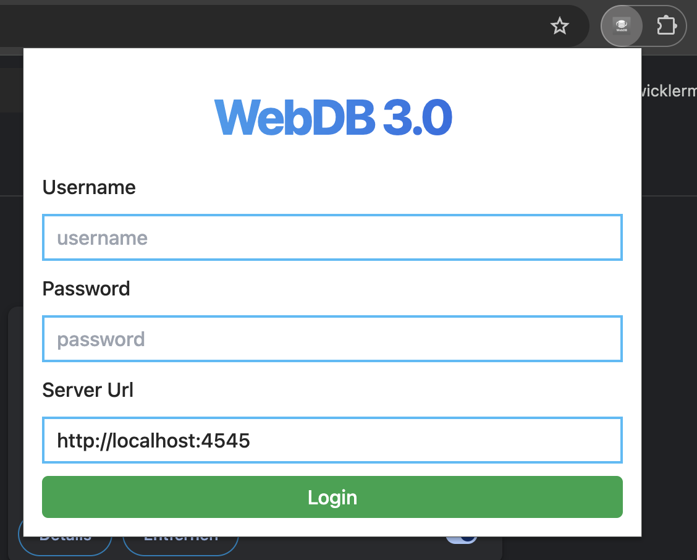

# Login

Öffnet man die Erweiterung nun durch ein klick auf das Icon in der
Navigations-Leiste, öffnet sich ein Fenster zum Login.



Die Nutzung von WebDB benötigt einen Account. Diese werden aktuell nur manuell
generiert und sollten dem Leser bereits bekannt sein. Falls nicht, schreibt mir
einfach eine Mail an [webdb@marenga.dev](mailto:webdb@marenga.dev)

Wichtig, aktuell ist die Server Url noch eine lokale zum testen. Diese muss
durch
```
https://webdb.click
```
ersetzt werden.

Danach einfach auf "Login" klicken. Sofern Username & Passwort korrekt waren,
öffnet sich nun ein neues interface.
