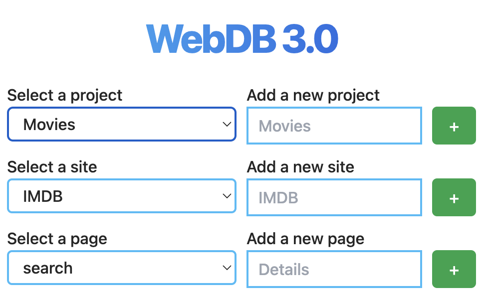

# Projekt Konfiguration

Um später mehrere Webseiten korrekt in die selbe Datenbank schreiben zu lassen,
benötigt es eine kurze Konfiguration dazu was gecrawlt werden soll.

Allgemein gilt dabei, dass im rechten Textfeld ein Name eingegeben wird und
mittels klick auf "+" ein neues Element in diesem Bereich hinzugefügt wird.

Wichtig dabei, alle Namen, bzw. Identifier müssten gewissen Anforderungen
erfüllen, um z.B. als Annotation, oder Text in der DB keine Probleme zu machen.

Diese Anforderungen sind:

- Der Name darf nur ASCII-alphanumerische Zeichen oder Unterstriche enthalten.
- Der Name muss mit einem alphabetischen Zeichen beginnen.
- Die Länge des Namens muss mehr als 2 Zeichen und weniger als 50 Zeichen betragen.
- Der Name darf nicht mit "_id" oder "_time" enden

## Project

Ein Projekt bündelt mehrere Webseiten in einer Datenbank. Es sollte nach dem
benannt werden _was_ man crawlt und nicht wo. Das bedeutet wenn man vorhat
_IMDB_ und _Rottentomatos_ zu crawlen, könnte man sie in einem **Movie**,
oder **Cinema** Projekt bündeln.

## Site

Diese ist der name der wirklichen Webseite, also z.B. _IMDB_. Der Name ist nicht
gezwungener maßen die Domain einer URL, es macht allerdings die Organisation
einfacher. Dies ist auch das Level, auf dem man das Crawling startet. Das
bedeutet man würde nicht ein ganzes Projekt (Movies => IMDB & Rottentomatos)
zusammen crawlen und auch nicht nur eine Unterseite (Top 250 Movies), sondern
konfigurieren wie und welche Unterseiten eine Webseite hat und dann alle Start-Seiten
crawlen. Dies ermöglicht es auch "rekursiv" zu crawlen, also Unterseiten zu haben,
die auf neue Unterseiten zum crawlen verweisen.

## Page

Diese ist eine konkrete Unterseite, also z.B. **Top_250_Movies**, oder
**Technical_Details**. Auf diesem Level werden Annotationen und Xpaths daraus
XPaths generiert, da wir hier die wirklich Daten extrahieren wollen und sich
unterschiedliche URLs einer Unterseite nicht groß voneinander unterscheiden
sollten.

---

Mit Project>Site>Page sinnvoll erstellt, kann nun die Annotation und
Konfiguration der Seite gestartet werden, dazu einfach auf die gewünschte Seite
navigieren und den "Start Annotation" Knopf drücken.
