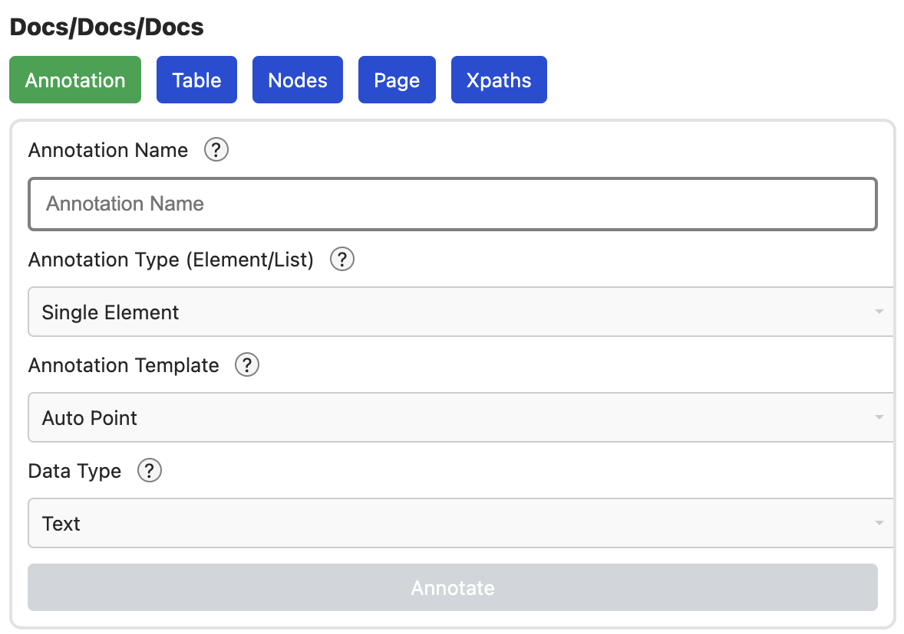

# Seiten Konfiguration

Das Interface, um eine Seite zu konfigurieren, ist ein Fenster, das
über der Seite angezeigt wird.

Darin gibt es 5 Tabs, um verschiedene Aspekte zu konfigurieren. Zum besten
verständnis, empfehle ich diese Reihenfolge:

- [Table](/chapter_table)
- [Nodes](/chapter_nodes)
- [Annotation](/chapter_annotation)
- [Page](/chapter_page)
- [XPaths](/chapter_xpaths)

Für eine kurze Quickstart Anleitung zum simplen crawling, sollte ein kurzer
Überblick zum annotieren

- [Annotation](/chapter_annotation)
- [Simple Demo](/chapter_example)
