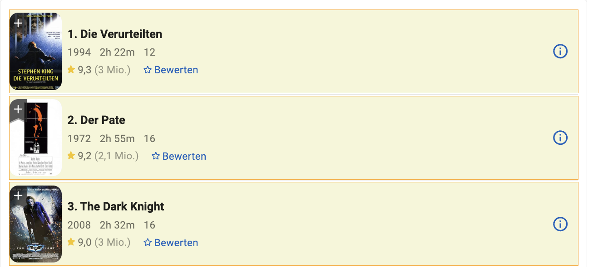
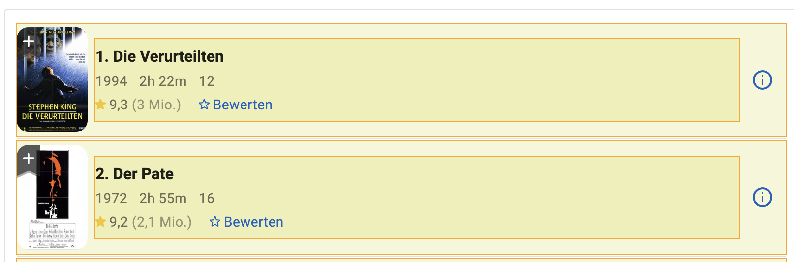

# Die Such-Seite

Unser Ziel auf dieser Seite ist es primär nur die URLs zu extrahieren. Dies benötigt
im wesentlichen zwei Schritte. Movies selektieren & URLs extrahieren

## Filme selektieren

Um alle Knoten zu selektieren, wählen wir im Annotations-Tab folgender
Einstellungen:

- **Annotation Name:** `Movie`
- **Annotation Count:** `Simple List` Da wir mehre Elemente annotieren wollen
- **Action:** `Auto Node` Erstellt automatisch eine neue Tabelle & Node mit dem Annotations Namen

Wir klicken auf `Annotate` und wählen nun die Movies so aus, dass sich die
Annotationen den gesamten Movie umfassen.

## Urls extrahieren

Um Urls zu extrahieren ist vollgende Konfiguration sinnvoll:

- **Annotation Name:** `MovieLink`
- **Annotation Count:** `Simple List` Da wir die Links aller Movies wollen
- **Action:** `Auto Point` Stellt sicher, dass der Link dem Movie zugeordnet wird
- **Data Type:** `Link` Extrahiert den ersten Link, der im selektierten Element gefunden wird. Erzeugt zudem eine fetch_url Zeile für Movie, markiert diese URL zum Crawlen der Movie Seite und erzeugt eine neue Seite "Movie", die bereits auf die Movie Tabelle konfiguriert ist

Eine grobe Auswahl des Bereichs, in dem der Link ist reicht aus

## Page Config

Damit wir die Seite auch korrekt crawlen, müssen wir zunächst XPaths
generieren. Dazu zum XPath Tab wechseln und den Knopf drücken. Nach ein paar
Sekunden, sollte das Ergebnis so aussehen:

Da wir uns auf der Startseite befinden, müssen wir diese Seite auch als
Crawling-Startseite festlegen. Um sicher zu stellen, dass alle Elemente geladen
werden, wollen wir zudem, dass dies Seite im Browser geöffnet wird und nach
unten gescrollt wird.

Das ganze sollte nun so ausssehen:

Nun nur noch speichern und diese Seite ist abgeschlossen.

## Test

Zum Testen, könnnen bereits das Crawling starten und uns das
Ergebnis über die DB Overview anschauen:

