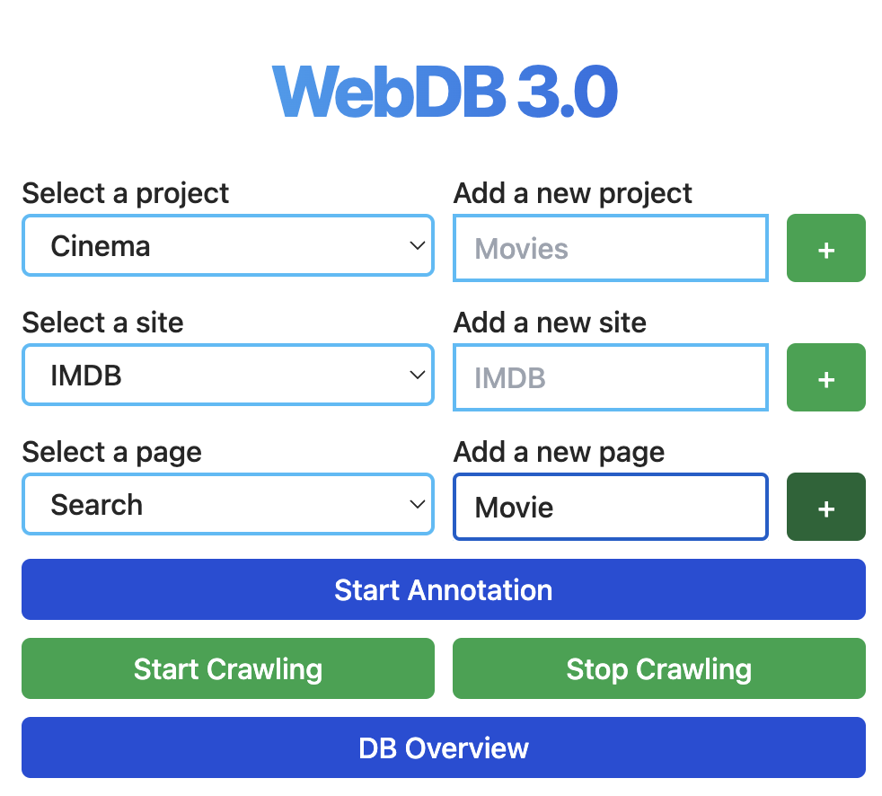
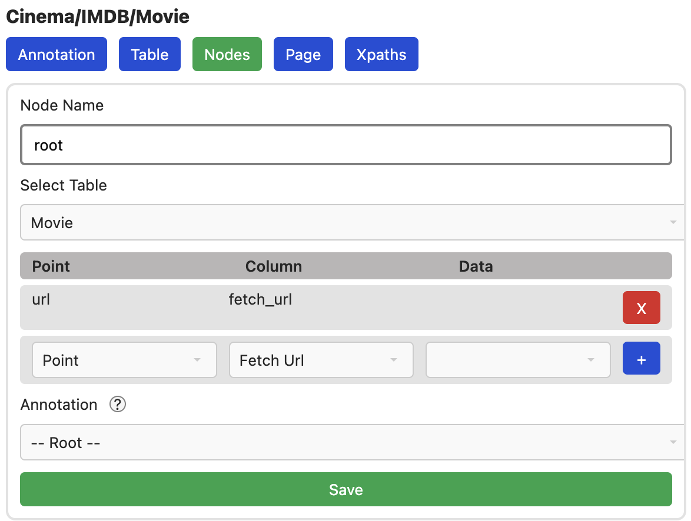

# Die Film-Seite (Details)

Mit der Konfigurtion der IMDB-Suche abgeschlossen, können wir nun zur
Detail-Seite wechseln. Dazu einfach auf einen der Filme klicken.

## Seite Erstellen & Konfigurieren
```
NOTE: Diese Schritte werden im nächsten Update nicht mehr erforderlich sein
```
Mit `DataType = Link` auf der vorherigen Seite, haben wir
bereits festgelegt, dass diese Links auf einen Movie verweisen. Wir erstellen
nun also eine `Movie' page im popup Fenster der Extension (`+` Drücken nicht vergessen).



Zudem müssen wir festlegen, dass diese Seite einen Movie beinhaltet. Dazu
starten wir die Annotation und wechseln in den Node Tab. Dort bearbeiten wir den
Root Node und wählen aus, dass dieser zum Movie Table gehört und dass wir unsere
aktuelle URL dem fetch_url column zuweisen wollen. Das ganze sieht dann so aus:



Nicht vergessen die Änderungen zu speichern

## Movie Infos

Da unsere Seite nun auf die Movie Tabelle verweist, können wir einfach simple Punkte
hinzufügen, die wir extrahieren wollen. Die default Annotations-Konfiguration
ist dafür bereits korrekt, wir müssen nur einen Namen und ggf. Datentyp festlegen:

- **Annotation Name:** `Title`
- **Annotation Type:** `Single Element` Da wir nur ein simples Element extrahieren wollen
- **Annotation Template:** `Auto Point` Erstellt automatisch eine neue Spalte in der Movies Tabelle
- **Data Type:** `Text`

Danach annotieren wir einfach das gewünschte Element


Das gleiche können wir für alle weiteren Elemente wiederholen:

- **Annotation Name:** `Description`
- **Annotation Type:** `Single Element` Da wir nur ein simples Element extrahieren wollen
- **Annotation Template:** `Auto Point` Erstellt automatisch eine neue Spalte in der Movies Tabelle
- **Data Type:** `Text`


## Test

Auch hier, können wir direkt testen, ob unsere Konfiguration funktioniert. Dazu
zunächst Xpaths generieren.


Da wir das Crawling nicht auf dieser Seite beginnen wollen und auch keine
Interaktionen brauchen, können wir einfach das crawling starten. Schauen wir
uns nach ein paar Sekunden das Resultat in der Datenbank an, sehen wir die neuen
Felder gefüllt mit Daten


