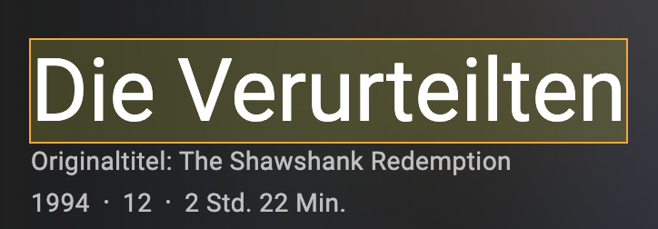
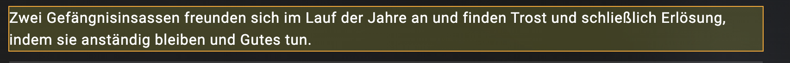
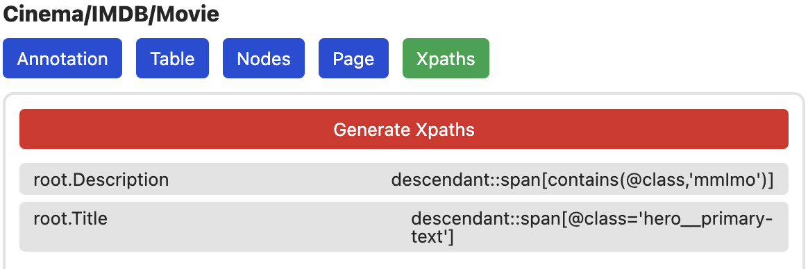
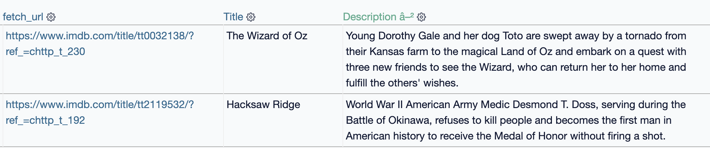

# Die Film-Seite (Details)

Mit der Konfigurtion der IMDB-Suche abgeschlossen, können wir nun zur
Detail-Seite wechseln. Dazu einfach auf einen der Filme klicken und im
Erweiterungs Popup-Menü die neue Movie Seite auswählen. Diese wurde erstellt,
als wir in den Movie node einen Link seleektiert haben.

## Movie Infos

Da diese Seite bereits auf die Movie Tabelle verweist, können wir einfach simple Punkte
hinzufügen, die wir extrahieren wollen. Die default Annotations-Konfiguration
ist dafür bereits korrekt, wir müssen nur einen Namen und ggf. Datentyp festlegen:

- **Annotation Name:** `Title`
- **Annotation Count:** `Single Element` Da wir nur ein simples Element extrahieren wollen
- **Action:** `Auto Point` Erstellt automatisch eine neue Spalte in der Movies Tabelle
- **Data Target:** `Table Insert`
- **Data Target:** `Text`

Danach annotieren wir einfach das gewünschte Element

Das gleiche können wir für alle weiteren Elemente wiederholen:

- **Annotation Name:** `Description`
- **Annotation Count:** `Single Element` Da wir nur ein simples Element extrahieren wollen
- **Action:** `Auto Point` Erstellt automatisch eine neue Spalte in der Movies Tabelle
- **Data Target:** `Table Insert`
- **Data Type:** `Text`

## Test

Auch hier, können wir direkt testen, ob unsere Konfiguration funktioniert. Dazu
zunächst Xpaths generieren.

Da wir das Crawling nicht auf dieser Seite beginnen wollen und auch keine
Interaktionen brauchen, können wir einfach das crawling starten. Schauen wir
uns nach ein paar Sekunden das Resultat in der Datenbank an, sehen wir die neuen
Felder gefüllt mit Daten

