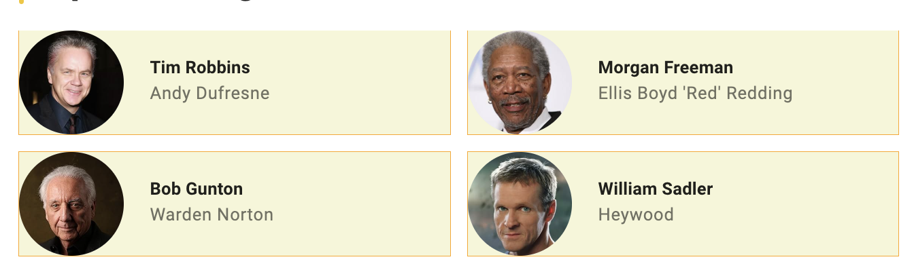
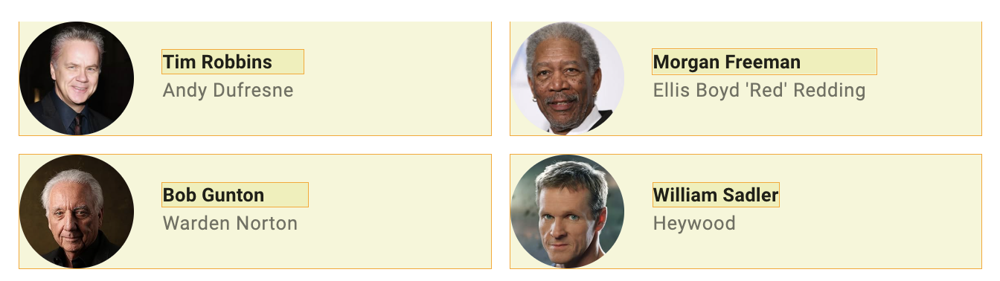
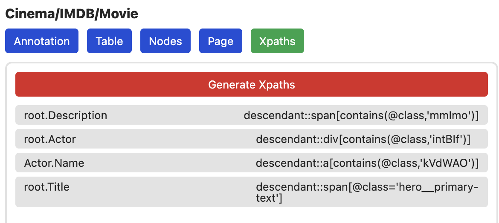
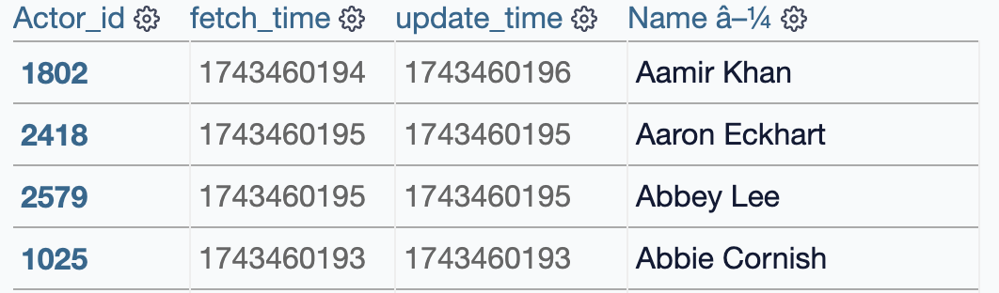

#  Die Film-Seite (Schauspieler)

Wir wollen neben den normalen Details zum Film ggf. auch Listen von
Informationen crawlen. Dazu wählen wir mit den selben Einstellungen wie auf der
Such-Seite einfach die Knoten aus:

- **Annotation Name:** `Actor`
- **Annotation Type:** `Simple List` Da wir mehre Elemente annotieren wollen
- **Annotation Template:** `Auto Node` Erstellt automatisch eine neue Tabelle & Node mit dem Annotations Namen

## Node Ident

Bei der Such-Seite haben wir als "Primary Key" für die Suchergebnisse die URLs
genommen. Das Selbe könnten wir jetzt auch tun. Zur Abwechslung werden wir jetzt
allerdings einfach den Namen nehmen. Dazu nehmen wir folgende Einstellungen:

- **Annotation Name:** `Name`
- **Annotation Type:** `Simple List` Da wir die Namen aller Schauspieler wollen
- **Annotation Template:** `Auto Point` Stellt sicher, dass der Name dem Actor zugeordnet wird
- **Data Type:** `Node Ident` Erstellt eine neue Spalte in der Actor Tabelle und setzt diese als Ident ~(Primary Key)

## Test

Zum Testen müssen wir wieder XPaths generieren.

Und können danach das Crawling starten. Wir sehen eine neue Actor Tabelle mit
allen einzigartigen Actors.

