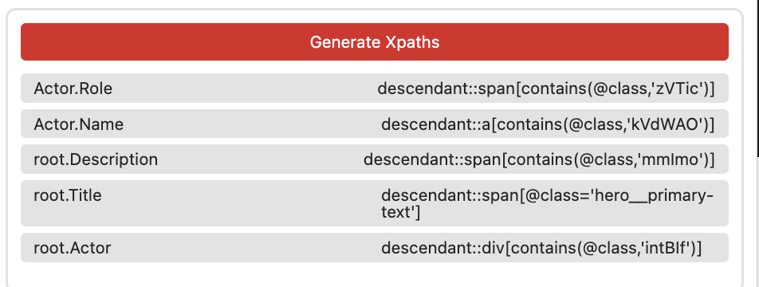

#  Die Film-Seite (Schauspieler)

Wir wollen neben den normalen Details zum Film ggf. auch Listen von
Informationen crawlen. Dazu wählen wir mit den selben Einstellungen wie auf der
Such-Seite einfach die Knoten aus:

- **Annotation Name:** `Actor`
- **Annotation Count:** `Simple List` Da wir mehre Elemente annotieren wollen
- **Action:** `Create Node` Erstellt automatisch eine neue Tabelle & Node mit dem Annotations Namen
- **Node Table:** `Auto` Erstellt eine Actor Tabelle
- **MtM Table:** `Auto` Erstellt eine Actor2Movie Tabelle, die automatisch geupdated wird

## Node Ident

Bei der Such-Seite haben wir als "Primary Key" für die Suchergebnisse die URLs
genommen. Das Selbe könnten wir jetzt auch tun. Zur Abwechslung werden wir jetzt
allerdings einfach den Namen nehmen. Dazu nehmen wir folgende Einstellungen:

- **Annotation Name:** `Name`
- **Annotation Count:** `Simple List` Da wir die Namen aller Schauspieler wollen
- **Action:** `Auto Point` Stellt sicher, dass der Name dem Actor zugeordnet wird
- **Data Target:** `Ident` Erstellt eine neue Spalte in der Actor Tabelle und setzt diese als Ident ~(Primary Key)

## Test

Zum Testen müssen wir wieder XPaths generieren.

Und können danach das Crawling starten. Wir sehen eine neue Actor Tabelle mit
allen einzigartigen Actors.

Zudem sehen wir eine Actor2Movie Tabelle, in der die Beziehungen zwischen Actor
und Movie gespeichert sind:

## Rolle

Ggf. ist uns das noch nicht genug. Wenn wir auch noch extra Daten, z.b. die
Rolle des Schauspielers in die Tabelle schreiben wollen. Dazu wählen wir die
Einstellungen wie bei einem normalen Punkt, nur dass wir MtM Insert als Data
Target wählen:

- **Annotation Name:** `Role`
- **Annotation Count:** `Simple List` Da wir mehre Elemente annotieren wollen
- **Action:** `Create Data Point`
- **Data Target:** `MtM Insert` Da wir in die MtM Tabelle zwischen Actor und
  movie schreiben wollen

Wir annotieren nun die Rolle:

## Test

Wir generieren wieder Xpaths, starten das Crawling und schauen uns die Tabelle an:

Ein Blick in die Datenbank zeigt, dass die neue Spalte korrekt mit Daten gefüllt wurde.

