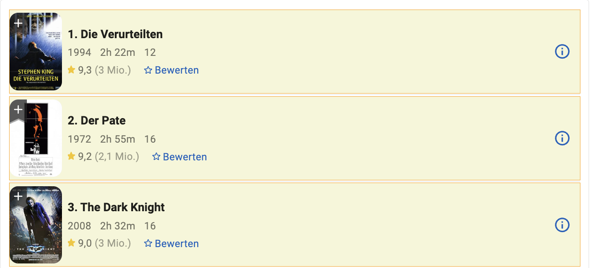
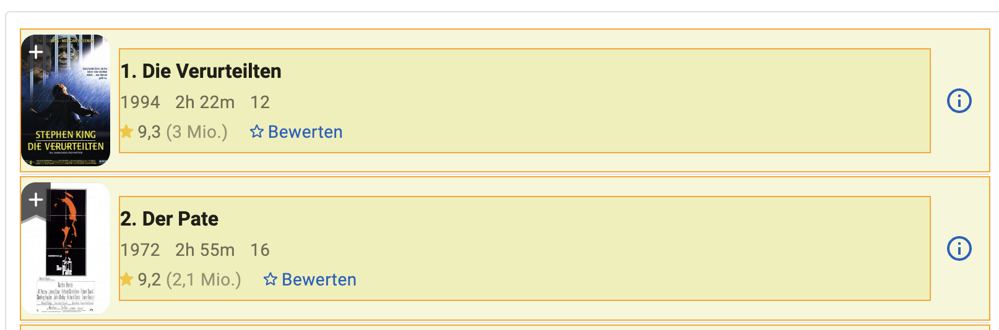

# Dynamische Seiten (Interaktionen & Knowledge)

Wenn man ein größeres Datenset auswerten möchte, wird man mit den 250 Top Filmen
vermutlich nicht weit kommen. Wir schauen uns also stattdessen nun die erweitere
Suche von IMDB an:

[https://www.imdb.com/de/search/title/](https://www.imdb.com/de/search/title/)

Da es sich hier um eine neue Seite handelt, erstellen wir dafür zunächst eine
neue Page im Popup der Erweiterung. In diesem Fall mit dem kreativen Namen
`AdvancedSearch`:

// TODO: Bild

## Voreinstellungen

Bei der Menge an Filmen auf IMDB ergibt es Sinn, nur relevante einträge zu
crawlen. Dazu wählen wir in den Einstellungen links aus, dass wir nur Filme mit
mindestens 100.000 Bewertungen sehen wollen. Wir klick auf
`Ergebnisse Anzeigen`, die Url ändert sich zu
`https://www.imdb.com/de/search/title/?title_type=feature&num_votes=100000,` und
wir sehen nun die Ergebnisse.

// TODO: Bild

## Buttons

Auf dieser und einigen anderen Seiten ist es erforderlich mit der Seite zu
interagieren, statt nur Werte zu extrahieren. Zuvor hat uns dazu die
`Scroll To End` Interaktion gereicht. Bei der erweiterten Suche handelt es
sich allerdings um eine manuelle Variation des "Infinite Scrolling" Mechanismus,
bei der man immer wieder `50 mehr` anklicken muss, um alle ergebnisse zu
extrahieren. Genau das wollen wir nun automatisieren. Dazu annotieren wir
zunächst den entsprechenden Knopf auf der Webseite mit der einfachsten
Annotations Variante:

- **Annotation Name:** `More`
- **Annotation Count:** `Single Element`
- **Action:** `Only Annotation` Erstellt nur eine Annotation

Wir klicken auf `Annotate` und wählen nun den Button so aus, dass das gesamte
klickbare Element ausgewählt ist.

// TODO: Bild

## Interaktionen

Wir wechseln in den Page tab und klicken genau wie auf der ursprünglichen
Such-Seite auf `Use Current Page`. Daraufhin geht es an die Interaktionen. Da der
Knopf such am Ende der Seite befindet, ergibt es sinn zunächst wieder mit einem
`Scroll To End` zum Ende der Seite zu navigieren. Wir wählen diesen Typ also
aus und klicken auf `+`.

Daraufhin wählen wir `Click` aus, was uns zwei Felder zum auswählen gibt. Das
Erste davon ist für die Annotation, also das Element, das wir anklicken wollen.
Das Zweite ist die Seite, zu der wir wechseln, wenn wir auf den Knopf drücken.
Dies kann nütlich sein, um z.B. von einer Suche (Text input) zu einer anderen
(Results) zu wechseln. Da wir hier allerdings auf der selben Seite bleiben,
wählen wir die aktuelle.

Wir wählen also:
- **More** Um den annotierten `50 Mehr` Button zu klicken
- **AdvancedSearch** Um auf der selben Seite zu bleiben.

und klicken daraufhin auf `Save`.

## Test

Wir können nun bereits testen, ob unsere Konfiguration funktioniert. Dazu
einfach wieder XPaths generieren. Und das crawling starten. Wenn die Top250
Seite noch konfiguriert ist, sollten beide Seiten nun nacheinander gecrawlt
werden, wobei die AdvancedSearch immer weiter nach unten scrollt.

Da wir noch keine anderen Elemente auf dieser Seite selektiert haben, finden
wir allerdings keine neuen Einträge in der Datenbank

## Filme

Um die Filme wie zuvor wirklich zu crawlen, müssen wir erneut die selben
Schritte, wie bei der Top250 Seite durchlaufen. Im Schnelldurchlauf:

Die Film-Knoten annotieren mit den folgenden Werten:

- **Annotation Name:** `Movie`
- **Annotation Count:** `Simple List` Da wir mehre Elemente annotieren wollen
- **Action:** `Create Node` Erstellt automatisch eine neue Tabelle & Node mit dem Annotations Namen

Wir klicken auf `Annotate` und wählen nun die Movies wieder so aus, dass sich die
Annotationen den gesamten Movie umfassen.

## Urls extrahieren

Um Urls zu extrahieren ist vollgende Konfiguration sinnvoll:

- **Annotation Name:** `MovieLink`
- **Annotation Count:** `Simple List` Da wir die Links aller Movies wollen
- **Action:** `Create Data Point` Stellt sicher, dass der Link dem Movie zugeordnet wird
- **Data Target:** `Link` Extrahiert den ersten Link, der im selektierten Element gefunden wird

Eine grobe Auswahl des Bereichs, in dem der Link ist reicht aus

## Test

Auch hier können wir nun wieder XPaths generieren und das crawling starten.
Dieses Mal werden neue Ergebnisse in der Datenbank auftauchen.

// TODO: Bild

## Segmentiertes crawling

Die Ergebnis-Seite kann schnell sehr groß werden. Bei 2000+ Ergebnisse mit
Bildern, Links, Text und ggf. Werbung, kann eine einzige so durchlaufene
Webseite oft mehre Gigabyte an Arbeitsspeicher und ähnlich viel CPU Leistung
kosten, um korrekt dargestellt zu werden. Wenn der Browser dadurch hängt, kann
dies zu Fehlern führen (Next Button wird nicht angezeigt, Browser stürzt ab,
etc.).

Wir sehen, dass unsere aktuelle URL die Anzahl der Votes als Parameter enthällt. Zum Testen, ändern wir auf der IMDB Seite die
Einstellungen, um auch eine Obergrenze hinzu zu fügen die URL wird:

https://www.imdb.com/de/search/title/?title_type=feature&num_votes=100000,2147483647

Wir können also die IMDB Suche über die Menge an Votes Segmentieren. Also zum
Beispiel immer in 100er Schritten. Dies können wir manuell machen, indem wir
zwischen Crawling-Durchläufen immer wieder die URL im Page tab verändern.

Diese Arbeit können wir allerdings auch automatisieren. Dazu wechseln wir in den
Knowledge Tab. Dort fügen wir eine neuen Eintrag mit dem Namen `range` hinzu
und klicken auf `Add`.

// TODO: Range definieren und URL ersetzen
