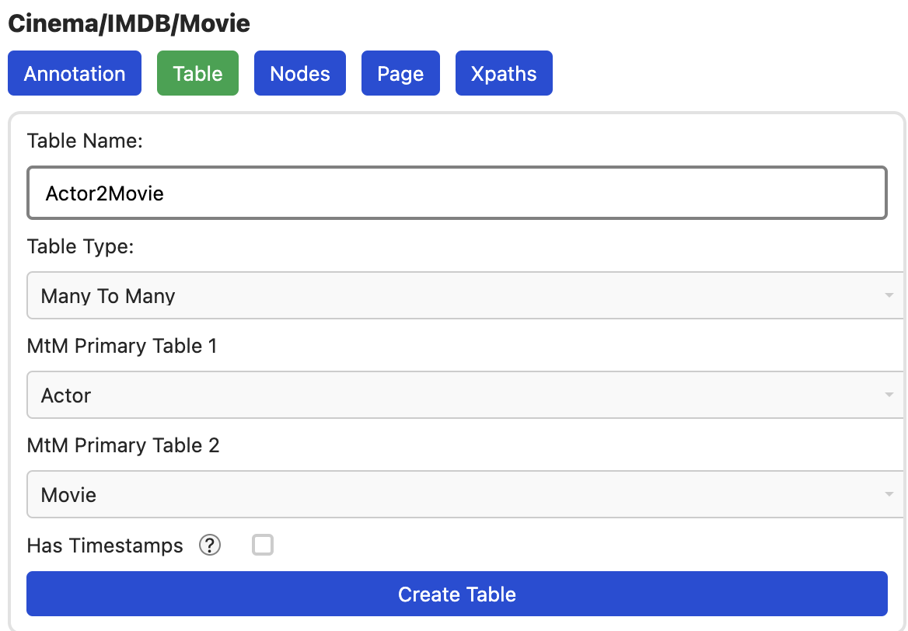
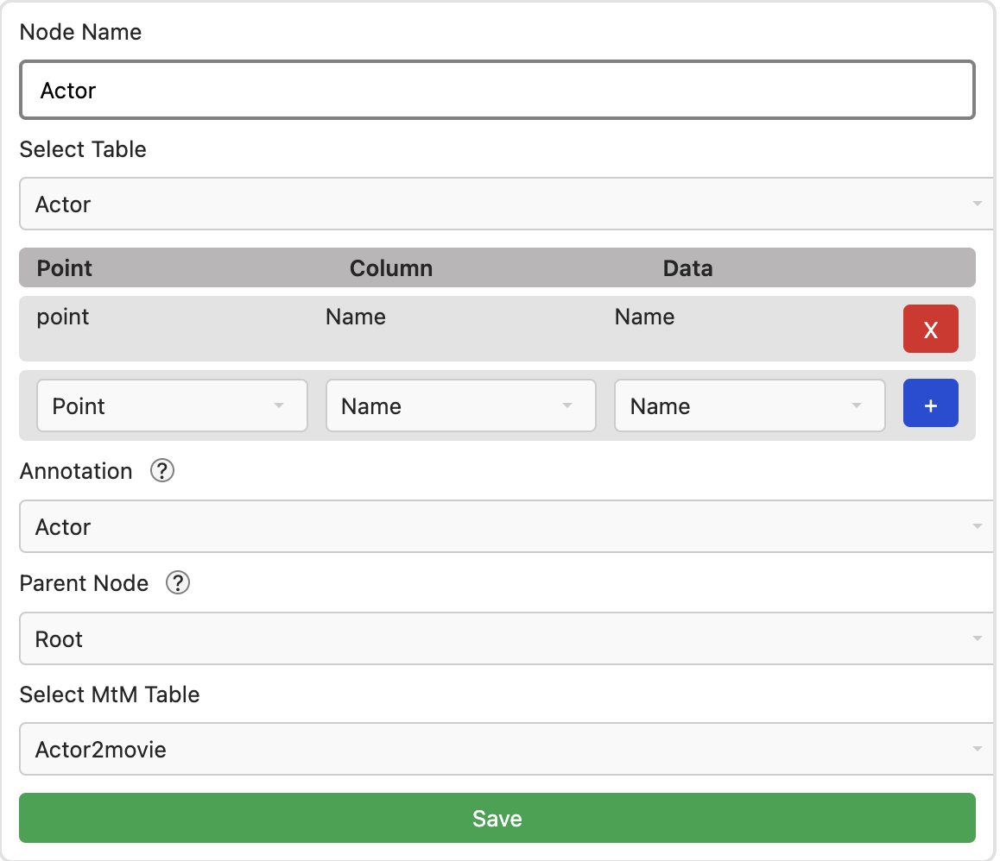
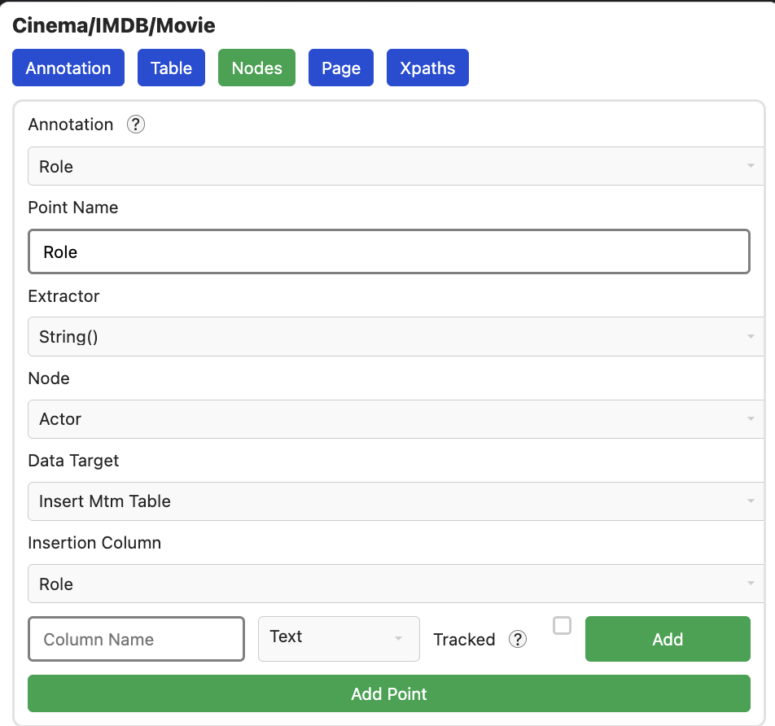

# Schauspieler (Many To Many)

```
NOTE: Diese ganze Dokumentations-Seite hier wird im nächsten Update überflüssig
```

## Konfiguration

Nur eine Tabelle mit allen Actors reicht uns vermutlich nicht. Was wir wollen
ist eine extra Tabelle, in der die Beziehung zwischen Film und Actor
gespeichert wird. Diese Tabelle erstellen wir in dem Table Tab über
`New Table`. Wir wählen `Many To Many` aus und setzen unsere beiden Tabellen
als Quellen. Der Name ist frei wählbar.



Nach `Create Table`, gibt es nun eine neue Tabelle. Wir müssen allerdings noch
angeben, dass unsere Actors diese nutzen sollen. Dazu gehen wir in den Node Tab
und konfigurieren Actor, indem wir MtM Table auf unsere neue Tabelle setzen.



`Save` klicken nicht vergessen

### Test

Wir können auch hier wieder unseren Zwischenstand testen. Da wir keine neuen
Knoten annotiert haben, brauchen wir auch keine Xpaths generieren und können
direkt das Crawling Starten. In der neuen Tabelle, können wir nun die Relation
der beiden Table sehen.


## Rolle

Ggf. ist uns das noch nicht genug. Wenn wir auch noch extra Daten, z.b. die
Rolle des Schauspielers in die Tabelle schreiben wollen. Da es noch kein
automatischen Ablauf dafür gibt. Wir wenden also folgende Einstellungen an:

- **Annotation Name:** `Role`
- **Annotation Type:** `Simple List` Da wir mehre Elemente annotieren wollen
- **Annotation Template:** `Point` Leitet uns nach dem Annotieren in das
  Fenster, in dem wir unseren Point konfigurieren

Wir annotieren nun die Rolle:


Im neuen Fenster stimmen schon fast alle Einstellungen. Wir wollen allerdings
nicht in die normale Table (Actor) schreiben, sondern in unsere neue. Dazu
wählen wir also `Insert MtM` statt `Insert Table`. Da diese Tabelle aktuell
noch leer ist, erstellen wir im unteren Dialog direkt eine neue Spalte mit
dem Namen Role und klicken auf `Add`.

```
NOTE: Diese Aktion lädt den Tab aktuell noch neu, man muss also erneut
`Insert MtM` auswählen
```



Der Datenpunkt ist damit erfolgreich konfiguriert. Ein Klick auf `Add Point`
fügt diesen nun hinzu.

### Test

Da wir eine neue Annotation haben, müssen wir auch wieder neue XPaths generieren.


Und daraufhin wieder das Crawling starten. Ein Blick in die Datenbank zeigt,
dass die neue Spalte korrekt mit Daten gefüllt wurde.


