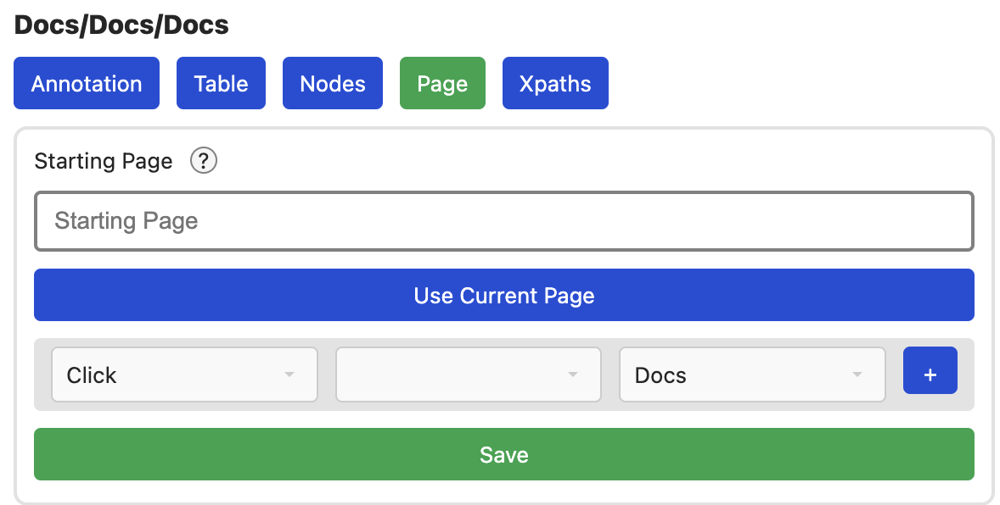

# Page

Im Page Tab, lassen sich Konfigurationen zu allen verbleibenden Details der Seite
vornehmen.



## Starting Page

Zum Crawling benötigt es mindestens eine Seite, bei der das Crawling beginnen
soll. Diese Seite wird hier festgelegt. Dazu einfach auf den `Use Current Page`
Knopf drücken. Wichtig, diese Eigenschaft wird *NICHT* automatisch gespeichert,
sondern erst nach dem klicken von `Save`. Diese URL kann vorher bei Bedarf noch
angepasst werden.

Besonders interessant ist das ersetzen von Werten mit vorgegebenen Wissen.
Bei einer URL wie

```
https://www.immobilien.de/results?postleitzahl=28215
```

lässt sich z.B. die Postleitzahl folgendermaßen ersetzen:

```
https://www.immobilien.de/results?postleitzahl={Postleitzahl}
```

Der Begriff in den `{}` Klammern wird in der Wissensbasis gesucht und durch
alle vorhandenen Werte ersetzt. Wenn man z.B. für `Postleitzahl = [28217, 28219]`
definiert hat, würde das Crawling mit allen folgenden URLs beginnen.

```
https://www.immobilien.de/results?postleitzahl=28217
https://www.immobilien.de/results?postleitzahl=28219
```

Auch komplexere replacements sind möglich, so können wir z.B. mit der URL

```
https://www.immobilien.de/results?postleitzahl={Postleitzahl}&typ={ImmobilienTyp}
```

und `ImmobilienTyp = [Haus, Wohnung]` alle folgenden URLs crawlen:

```
https://www.immobilien.de/results?postleitzahl=28217&typ=Haus
https://www.immobilien.de/results?postleitzahl=28217&typ=Wohnung
https://www.immobilien.de/results?postleitzahl=28219&typ=Haus
https://www.immobilien.de/results?postleitzahl=28219&typ=Wohnung
```

```
INFO: Das ganze funktioniert bereits ist aber wirklich erst zu nutzen, wenn
der Knowledge tab implementiert ist
```

## Interaktionen

Manche Seiten benötigen bestimmte Interaktionen, um richtig zu funktionieren,
oder um Suchergebnisse anzuzeigen. Dazu lassen sich um unteren Abschnitt
Interaktionen definieren, die gemacht werden sollen.

Wichtig ist, dass eine Seite mit Interaktionen immer von Browser gecrawlt
werden muss. Dies ist langsamer als das crawling von statischen Seiten, was vom
Server schnellerer Internet-Verbingung und parallel erfolgen kann.

Die folgenden Interaktionen sind gegeben:
- **Click:** Klickt auf den Knopf mit der gewünschten Annotation. Da das
  Klicken von Knöpfen oft die Seite wechselt, muss zusätzlich angegeben werden,
  zu welcher Seite diese Interaktion führt. Eine sinvolle Konfiguration auf
  einer Startseite wäre z.B. `Annotation: 'ErgebnisseAnzeigenKnopf', Page: 'Ergebnisse'`
- **Input:** Schreibt den gewünschten Text in das Input Element mit der
  selektierten Annotation. Interessant wird dies hauptsächlich wieder mit
  Ersetzungen. Diese laufen genau wie bei der Url. `{Postleitzahl}` würde also
  alle Postleitzahlen eingeben. Dies passiert natürlich nicht gleichzeitig,
  sondern nacheinander, sobald das Crawlen der ersten Postleitzahl
  abgeschlossen wurde.
- **Scroll To End:** Versucht einfach nur zum Ende der Seite zu scrollen. Dies
  kann bei Seiten wichtig sein, die sonst nicht alle Elemente anzeigen.
- **Send Current:** Sendet den aktuellen stand der Webseite zum Server zum
  Auswerten. Dies passiert automatisch, wenn ein Click navigiert, oder das Ende
  der Interaktionen erreicht ist. Für dynamische Seiten, dessen Stand man z.B.
  vor und nach einem `Input` auswärten möchte, kann es allerdings sinnvoll sein,
  diese Option zu nutzten.

Ein Klick auf das `+` fügt die Interaktion hinzu. Bestehende Interaktionen
lassen sich mit `X` entfernen

Zum Schluss muss der aktuelle Stand mit `Save` gespeichert werden.
