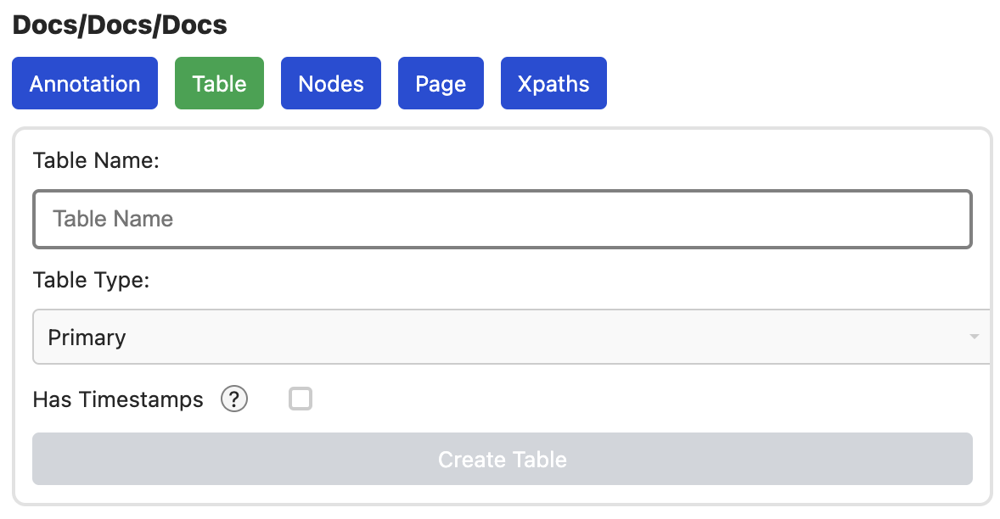
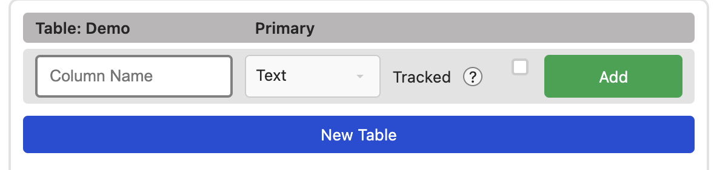

# Table Konfiguration

Im Table tab, lassen sich die Tabellen der Datenbank konfigurieren.

## New Table

Ein klick auf `New Table` öffnet den Dialog zum Erstellen einer neuen Tabelle.



Darin lässt sich der Typ der Tabelle bestimmen

- **Primary:** Eine normale Tabelle, in die Daten geschrieben werden können und
  die andere Tabellen Typen referenzieren können
- **Secondary:** Eine Tabelle mit einer `One-To-One` Relation zu einer anderen
  Primary Table. Damit lassen sich Tabellen schmaler machen, also z.B. nur
  wichtige Daten, wie `URL, Title` in eine Primary table zu schreiben und alles
  andere `Description, UserRating` in eine, oder mehrere andere Tabellen zu
  schreiben. Ich bin selbst nicht überzeugt von dieser Nutzung, aber WebDB 2.0
  hatte dieses Feature, also gibt es das hier auch.
- **Many To Many:** Eine Tabelle, die zwei andere Tabellen miteinander
  verbindet. Nach Konvention, sollte man diese nach dem Schema `TableA2TableB`
  benennen. Diese Tabelle kann auch extra Felder haben, um z.B. den speziellen
  Typ der Relation anzugeben (`Actor`) und/oder andere extra Infos, wie die
  Rolle in einem Film (`Darth Vader`).

Zudem gibt es eine Option für Timestamps. Diese speichert die Zeit der
Erstellung und die Zeit des letzten Updates für jede Zeile.

`Create Table` erstellt die Tabelle

## New Column

Mit einer vorhandenen Tabelle, zeigt sich eine neue Option, um für jede Tabelle
neue Spalten hinzuzufügen.



Die drei Optionen sind:
- **Name** der neuen Spalte
- [**Datentyp**](https://www.sqlite.org/datatype3.html) der Spalte
- **Tracked**: Checkbox, ob die Veränderung von Daten getrackt werden sollen. *TODO: Aktuell wird dies nur im dem Server Log ausgegeben. Andere (nutzbare) Output Formate werden folgen*

Ein Klick auf `Add` fügt die Spalte der Tabelle hinzu

## Edit Table/Column

```
TODO:
```


## Indexes

```
TODO:
```
