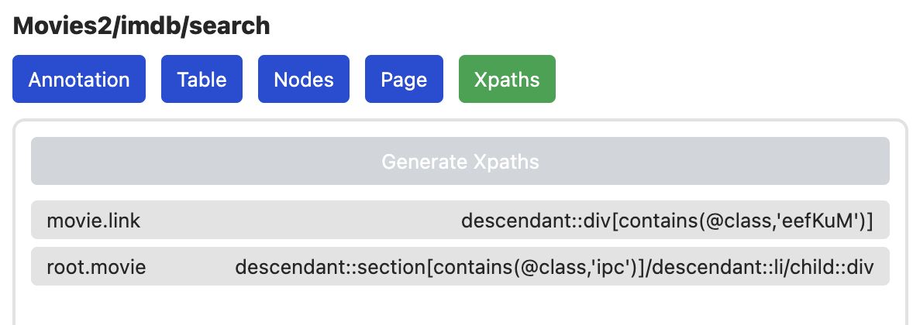

# Xpaths

Der Xpaths Tab zeigt alle Xpaths der aktuellen Seite an. Xpaths geben an, wie
das HTML DOM navigiert werden muss, um die Daten wirklich zu extrahieren.



Ein Klick auf `Generate Xpaths` sendet die aktuell annotierte Seite an den
Server und aktuallisiert die Liste nach dem Abschluss mit den neuen Werten.

```
TOOD: Choose Xpaths
```
